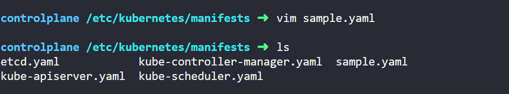
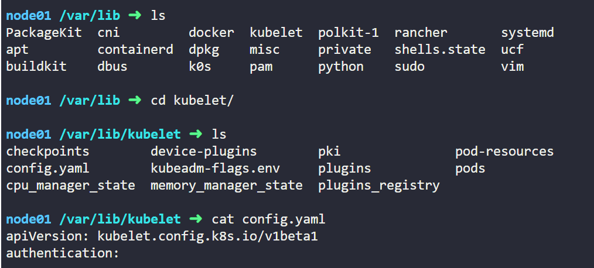

https://kubernetes.io/docs/tasks/configure-pod-container/static-pod/

kubectl create -f /etc/kubernetes/manifests/sample.yaml

File should be in /etc/kubernetes/manifests/ where worker node acts as controlplane with other configurations.